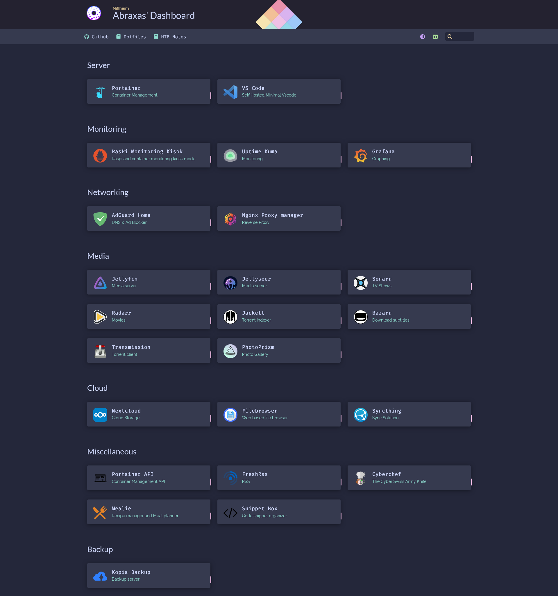

# Self-hosted HomeLab



| Service                                                              | Description                                                                                                                                                                                                                                                                                                                                                                  |
| -------------------------------------------------------------------- | ---------------------------------------------------------------------------------------------------------------------------------------------------------------------------------------------------------------------------------------------------------------------------------------------------------------------------------------------------------------------------- |
| [AdGuard Home](https://github.com/AdguardTeam/AdGuardHome)           | Ad and tracking blocking DNS server                                                                                                                                                                                                                                                                                                                                          |
| [AdGuardian-term](https://github.com/Lissy93/AdGuardian-Term)        | Terminal client for AdGuard home stats                                                                                                                                                                                                                                                                                                                                       |
| [Authelia](https://github.com/authelia/authelia)                     | SSO portal with MFA support                                                                                                                                                                                                                                                                                                                                                  |
| [Calibre Web](https://github.com/janeczku/calibre-web)               | Storing/ Browsing eBooks                                                                                                                                                                                                                                                                                                                                                     |
| [Cloudflare Tunnel](https://hub.docker.com/r/cloudflare/cloudflared) | Create and manage cloudflare tunnels                                                                                                                                                                                                                                                                                                                                         |
| container-monitoring                                                 | Container resource monitoring with [Prometheus](https://prometheus.io), [Grafana](https://grafana.com), [cAdvisor](https://github.com/google/cadvisor), [Node Exporter](https://github.com/prometheus/node_exporter)                                                                                                                                                         |
| [Cyberchef](https://gchq.github.io/CyberChef/)                       | The Cyber Swiss Army Knife                                                                                                                                                                                                                                                                                                                                                   |
| [Filebrowser](https://github.com/filebrowser/filebrowser)            | Web based file browser                                                                                                                                                                                                                                                                                                                                                       |
| [Filestash](https://github.com/mickael-kerjean/filestash)            | Web based file browser                                                                                                                                                                                                                                                                                                                                                       |
| [Freshrss](https://github.com/FreshRSS/FreshRSS/)                    | RSS Aggregator                                                                                                                                                                                                                                                                                                                                                               |
| [Homer](https://github.com/bastienwirtz/homer)                       | Static homepage server                                                                                                                                                                                                                                                                                                                                                       |
| [It-tools](https://github.com/CorentinTh/it-tools)                   | Handy tools for dev                                                                                                                                                                                                                                                                                                                                                          |
| [Jellyfin](https://github.com/jellyfin/jellyfin)                     | Media server                                                                                                                                                                                                                                                                                                                                                                 |
| [Jellyseer](https://github.com/Fallenbagel/jellyseerr)               | Requests manager for media server                                                                                                                                                                                                                                                                                                                                            |
| [Kopia](https://kopia.io)                                            | Backup software                                                                                                                                                                                                                                                                                                                                                              |
| [Mealie](https://github.com/hay-kot/mealie)                          | Recipe manager and Meal planner                                                                                                                                                                                                                                                                                                                                              |
| Mediastack                                                           | [Jellyseer](https://github.com/Fallenbagel/jellyseerr), [Sonarr](https://github.com/Sonarr/Sonarr), [Radarr](https://github.com/Radarr/Radarr), [Bazarr](https://github.com/conedevelopment/bazar), [Jackett](https://github.com/Jackett/Jackett), [Transmission](https://github.com/transmission/transmission), [FlareSolver](https://github.com/FlareSolverr/FlareSolverr) |
| [Nextcloud](https://github.com/nextcloud/docker)                     | Self hosted cloud                                                                                                                                                                                                                                                                                                                                                            |
| [Ngnix Proxy Manager](about:blank)                                   | Reverse Proxy                                                                                                                                                                                                                                                                                                                                                                |
| [Pairdrop](https://github.com/schlagmichdoch/PairDrop)               | P2P file sharing                                                                                                                                                                                                                                                                                                                                                             |
| [Paperless-ngx](https://github.com/paperless-ngx/paperless-ngx)      | Document manager and scanner                                                                                                                                                                                                                                                                                                                                                 |
| ~~[Pi.Hole](https://github.com/pi-hole/pi-hole)~~                    | Ad blocker and DNS sinkhole                                                                                                                                                                                                                                                                                                                                                  |
| [Portainer](https://www.portainer.io/)                               | Managing docker containers                                                                                                                                                                                                                                                                                                                                                   |
| [Samba](https://hub.docker.com/r/elswork/samba)                      | SMB                                                                                                                                                                                                                                                                                                                                                                          |
| [Snippet Box](https://github.com/pawelmalak/snippet-box)             | Code snippets organizer                                                                                                                                                                                                                                                                                                                                                      |
| ~~[swag](https://github.com/swaggo/swag)~~                           | Reverse Proxy + Certbot + fail2ban                                                                                                                                                                                                                                                                                                                                           |
| [Syncthing](https://github.com/syncthing/syncthing)                  | P2P file synchronizer                                                                                                                                                                                                                                                                                                                                                        |
| [Tailscale](https://tailscale.com/kb/)                               | Encrypted P2P Mesh VPN with wireguard protocol                                                                                                                                                                                                                                                                                                                               |
| [Transmission](https://github.com/transmission/transmission)         | Torrent client                                                                                                                                                                                                                                                                                                                                                               |
| [Uptime Kuma](https://github.com/louislam/uptime-kuma)               | Monitoring tool                                                                                                                                                                                                                                                                                                                                                              |
| [VsCode](https://github.com/gitpod-io/openvscode-server)             | Minimal VSCode server                                                                                                                                                                                                                                                                                                                                                        |
| [Watchtower](https://github.com/containrrr/watchtower)               | Automatically update docker images                                                                                                                                                                                                                                                                                                                                           |

## Setup

### Install docker and docker-compose

```bash
yay -S docker
yay -S docker-compose
```

```bash
sudo usermod -aG docker $USER
newgrp docker
_ systemctl enable docker --now
```

### Setting up services

`cd`into the directory and run

```bash
docker-compose up -d --force-recreate --remove-orphans
```

Some conatiners need a `.env` file, there's a `.env.example` file to refer to for that. Same goes for `config.yml` if required

### Docker cgroup memory issue fix

On arm devices, enabling cgroud memory doesn't take effect.
Adding this to `/boot/cmdline.txt` and rebooting should help fix the issue, [src](https://github.com/docker/for-linux/issues/1112)

```txt
cgroup_enable=cpuset cgroup_enable=memory cgroup_memory=1
```

Verify by running.

```bash
docker stats
```

## Contributing

Install pre-commit

```bash
pipx install pre-commit
pre-commit install
```

Update tags for the pre-commit hooks and dry run

```bash
pre-commit autoupdate
pre-commit run --all-files --verbose
```

## ToDo

-   [x] Switch pihole to AdGuard Home
-   [x] Add watchdog to automatically update docker containers
-   [x] Setup Sonarr, Radarr and Jackett
-   [ ] Switch to Traefik as the reverse proxy
-   [x] ~~Add wireguard configs~~
-   [x] Setup tailscale for remote access
-   [ ] Setup VaultWarden
