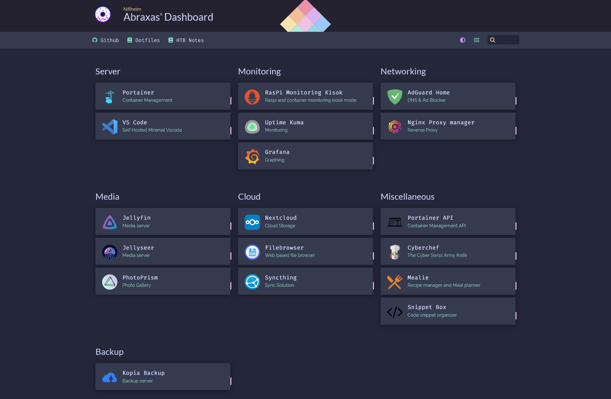

# Self-hosted HomeLab



-   [Calibre-web](./calibre-web/)
-   [Cloudflare tunnel](./cloudflare-tunnel/)
-   [Container Monitoring](./container-monitoring/)
    -   Prometheus
    -   Grafana
    -   cAdvisor
    -   node-exporter
-   [Filebrowser](./filebrowser/)
-   [Homer](./homer/)
-   [Jellyfin](./jellyfin/)
-   [Nextcloud](./nextcloud/)
-   [Ngnix Proxy Manager](./ngnix-proxy-manager/)
-   [Paperless-ngx](./paperless-ngx/)
-   [PhotoPrism](./PhotoPrism/)
-   [Pihole](./pihole/)
-   [Portainer](./portainer/)
-   [Samba Share](./samba/)
-   [Syncthing](./syncthing/)
-   [Tailscale VPN](./tailscale/)
-   [Uptime Kuma](./uptime-kuma/)
-   [Minimal Vscode](./vscode/)
-   [Wireguard](./wireguard/)

## Setup

### Install docker and docker-compose

```bash
yay -S docker
yay -S docker-compose
```

```bash
sudo usermod -aG docker $USER
newgrp docker
_ systemctl enable docker --now
```

### Setting up services

`cd`into the directory and run

```bash
docker-compose up -d --force-recreate --remove-orphans
```

Some conatiners need a `.env` file, there's a `.env.example` file to refer to for that. Same goes for `config.yml` if required

## Contributing

Install pre-commit

```bash
pipx install pre-commit
pre-commit install
```

Update tags for the pre-commit hooks and dry run

```bash
pre-commit autoupdate
pre-commit run --all-files --verbose
```

## ToDo

-   [x] Switch pihole to AdGuard Home
-   [ ] Add watchdog to automatically update docker containers
-   [ ] Switch to Traefik as the reverse proxy
-   [ ] Add wireguard configs
-   [ ] Setup VaultWarden
