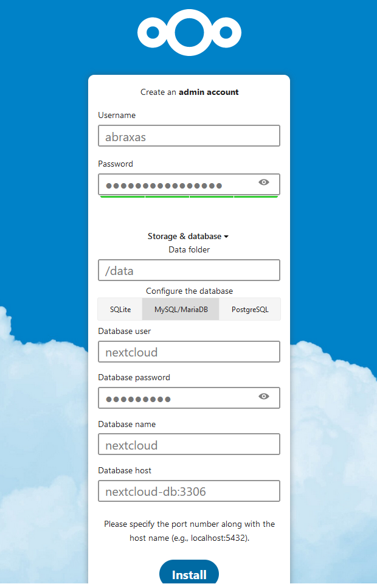
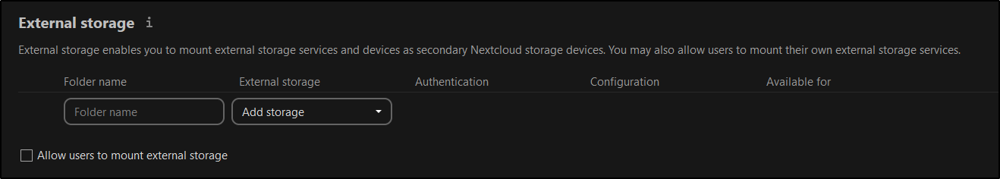

# Nextcloud for Rpi

## Basic setup

Nextcloud can be used with sqlite as the database, but using a proper database would be more efficient for more transactional workflow

The database settings can be configured during the initial setup

Example:


Since we need a database, an [ARM compatible image for mariabDB](https://hub.docker.com/r/yobasystems/alpine-mariadb/) is added to the compose which is linked to the nextcloud service

## Fix data directory permission issue

The directory bound to `/data` is resides in an mounted external hard disk
The hdd is mounted as a non root user, so that I don't have read-write access to the disk

```bash
> cat /etc/fstab
[....]
UUID=xxxx         /media/segateHdd                exfat           defaults,uid=2002,gid=2003,nofail,x-systemd.device-timeout=9  0 0
[....]
```

This raises another problem: ideally, another user shouldn't list the data directory. Add `'check_data_directory_permissions' => false,` to the array in `config.php` to fix this.
Since the `/config` is bound to a local directory it can be edited there or by getting an interactive terminal for the container

```bash
root@nextcloud:/# ls -la /config/www/nextcloud/config/config.php
-rw-r----- 1 abc abc 691 May 10 14:07 /config/www/nextcloud/config/config.php
```

Additional external storage can be configured via the `External Storage` tab in settings

